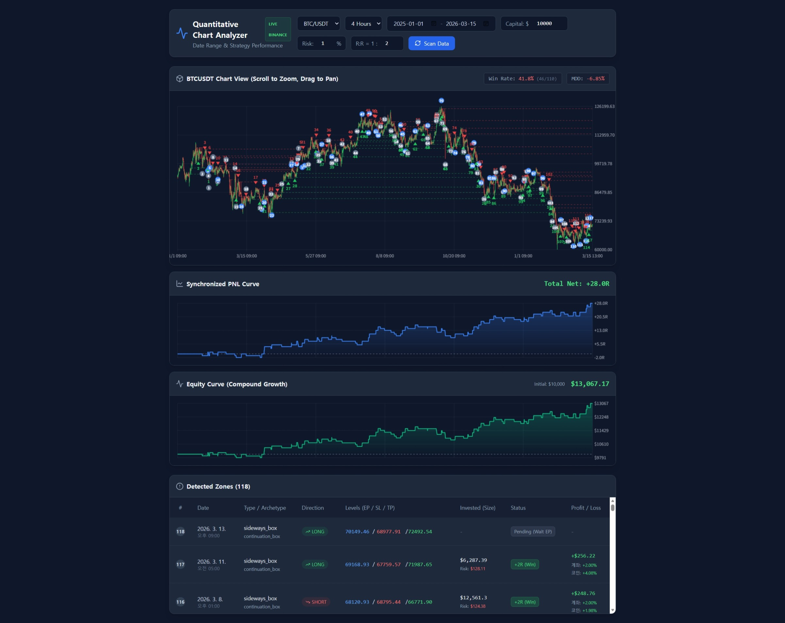

# Quantitative Chart Analyzer - 프로젝트 문서


본 문서는 Binance API를 활용하여 시장 데이터를 수집하고, 횡보 박스(Sideways Box) 전략을 기반으로 매매 타점을 분석 및 백테스트하는 **[정량적 차트 분석기 대시보드]** 에 대한 상세 안내서입니다.

## 1. 코드 상세 설명

이 애플리케이션은 크게 **[코어 엔진]** 과 **[리액트 뷰(UI)]** 두 부분으로 나뉘며, 하나의 파일(`ChartAnalyzerView.tsx`)에 모듈화되어 작성되었습니다.

### 1.1. 코어 엔진 로직 (Core Engine)

시장 데이터를 분석하여 의미 있는 매매 타점(Zone)을 찾아내고, 상태를 추적하는 백엔드 성격의 로직입니다.

- **`BinanceAPI` 클래스**

  - **역할:** 바이낸스 REST API(`/api/v3/klines`)를 호출하여 OHLCV(시가/고가/저가/종가/거래량) 캔들 데이터를 가져옵니다.
  - **특징:** 한 번에 불러올 수 있는 최대 제한(1,000개)을 극복하기 위해 `while` 루프를 사용한 **Pagination(페이지네이션)** 로직이 구현되어 있습니다. 지정된 기간의 데이터를 모두 가져올 때까지 반복 호출하며, API Rate Limit 보호를 위해 지연(50ms)을 줍니다. 네트워크 오류 시 내장된 `Mock Data` 를 반환하는 Fallback 기능이 있습니다.
- **`Indicators` 클래스**

  - **역할:** 차트 분석에 필요한 수학적/기술적 지표를 계산합니다.
  - **구현 지표:** RSI (Wilder's Smoothing 방식), Regular Divergence(일반 다이버전스 - 3-bar 프랙탈 피벗 기반), 거래량 확장(Volume Expansion), 핀바(Pinbar) 및 장악형(Engulfing) 캔들 패턴 인식을 담당합니다.
- **`SidewaysBoxDetector` 클래스**

  - **역할:** 핵심 매매 전략인 '횡보 박스'를 감지합니다.
  - **로직:** 1. 캔들들을 순회하며 박스의 상/하단(High/Low) 경계를 정의합니다.
2. 가격이 경계를 이탈(돌파)하면 박스 형성을 인식합니다.
3. 돌파 후 3캔들 동안 박스 내부의 오더블록(OB)으로 재진입하지 않는지 **유효성(Validation)**을 검사합니다.
4. 추세 지속형(Continuation), 돌파 준비형(Breakout Prep), 변곡점(Turning Point) 등 **아키타입(Archetype)**을 분류합니다.
5. 지표(RSI, 다이버전스, 거래량 등)를 기반으로 점수(Score)를 매겨 기준점(70점) 이상인 타점만 필터링합니다.
6. 사용자가 설정한 R:R(Risk to Reward) 비율에 따라 EP(진입가), SL(손절가), TP(목표가)를 계산합니다.
- **`ChartEngine` 클래스**

  - **역할:** 감지된 박스들의 생명주기(Lifecycle)를 관리합니다.
  - **로직:** 겹치는 타점을 제거(Dedupe)하고, 차트가 진행됨에 따라 타점의 상태를 `Active` (대기 중) -> `Filled` (EP 도달/체결) -> `Reacted` (TP 도달/익절) 또는 `Invalidated` (SL 도달/손절)로 실시간 업데이트합니다.

### 1.2. 리액트 뷰 (React UI)

코어 엔진의 분석 결과를 시각화하고 사용자와 상호작용하는 프론트엔드 파트입니다.

- **상태 관리 (State)**

  - `rawCandles`, `boxes`, `pnlData`: 엔진의 분석 결과를 저장합니다.
  - `tradeStats`: 승률(Win Rate)과 최대 낙폭(MDD)을 실시간으로 계산하여 저장합니다.
  - `viewState`: 마우스 휠 및 드래그를 통한 캔버스 Zoom/Pan 상태(offset, count)를 관리합니다.
- **Canvas 렌더링 (동기화된 3개의 차트)**

  - `HTML5 Canvas API` 를 직접 사용하여 고성능 렌더링을 구현했습니다.
  - **Main Chart:** 캔들스틱, 횡보 박스 영역, 연장선(EP~청산 지점), 진입 화살표(▲/▼), 청산 원형 마커 및 번호를 그립니다.
  - **PNL Curve:** 누적 손익비(R 단위)의 변화를 꺾은선 및 그라데이션 영역으로 그립니다.
  - **Equity Curve:** 초기 자본(Capital)과 리스크(%) 기반의 복리 자산 변동을 그립니다.
  - *동기화 메커니즘:* 세 캔버스는 동일한 `visibleCandles` 배열과 `getX()` 좌표 계산식을 공유하여, 마우스로 차트를 이동하거나 확대해도 X축(시간축)이 완벽하게 일치하여 움직입니다.
- **백테스팅 지표 및 데이터 테이블**

  - **고정 리스크 자본 관리:** 설정한 Risk %(예: 1%)에 맞춰 각 타점별로 투입되어야 할 포지션 사이즈(Position Size)를 역산하여 달러($)로 표기합니다.
  - 테이블에 각 거래별 승패, 자산 대비 손익률(%), 코인 순수 등락률(%)을 상세하게 나열합니다.

## 2. 사용 및 설치 방법

본 프로젝트는 최신 React 및 Tailwind CSS(v3) 환경에서 동작하도록 설계되었습니다. 로컬 환경에서 실행하려면 아래 단계를 따라주세요.

### 2.1. 사전 준비

- [Node.js](https://nodejs.org/) 가 시스템에 설치되어 있어야 합니다.

### 2.2. 프로젝트 세팅 단계

터미널을 열고 아래 명령어들을 차례대로 실행합니다.

```
# 1. Vite를 사용하여 React + TypeScript 프로젝트 생성
npm create vite@latest chart-analyzer -- --template react-ts

# 2. 생성된 폴더로 이동
cd chart-analyzer

# 3. 기본 의존성 설치
npm install

# 4. 아이콘 라이브러리 및 Tailwind CSS(v3) 설치
npm install lucide-react
npm install -D tailwindcss@3 postcss autoprefixer

# 5. Tailwind 설정 파일 초기화
npx tailwindcss init -p
```

### 2.3. 코드 덮어쓰기 및 설정

1. **Tailwind 설정:** 생성된 `tailwind.config.js` 파일을 열고 아래 내용으로 교체합니다.

```
/** @type {import('tailwindcss').Config} */
export default {
  content: [
    "./index.html",
    "./src/**/*.{js,ts,jsx,tsx}",
  ],
  theme: {
    extend: {},
  },
  plugins: [],
}
```

1. **CSS 설정:** `src/index.css` 파일의 모든 내용을 지우고 아래 세 줄을 입력합니다.

```
@tailwind base;
@tailwind components;
@tailwind utilities;
```

1. **앱 코드 적용:** 완성된 `ChartAnalyzerView.tsx` 파일의 전체 코드를 복사한 뒤, 로컬 프로젝트의 `src/App.tsx` 파일 내용을 모두 지우고 붙여넣습니다.

### 2.4. 앱 실행

모든 준비가 완료되었습니다. 터미널에 아래 명령어를 입력하세요.

```
npm run dev
```
브라우저에서 `http://localhost:5173` 에 접속하여 분석기 대시보드를 사용할 수 있습니다.

## 3. 프롬프트 업데이트 문서화 (Prompt History)

해당 코드를 처음부터 완성하기까지 사용된 논리적 지시(Prompt) 과정을 단계별로 정리한 문서입니다. 추후 비슷한 시스템을 만들 때 이 구조를 참고하여 AI에게 지시할 수 있습니다.

### 단계 1: 코어 엔진 설계 및 API 연동

> "퀀트 차트 분석기 엔진의 TypeScript 코드를 작성해 줘. 바이낸스 API(/api/v3/klines)를 연동하여 OHLCV 데이터를 가져오고, 'sideways_box(횡보 박스)'라는 새로운 매매 패턴을 감지하는 로직을 구현해야 해.
> 박스 감지 조건: 돌파 캔들 확인 후 3캔들 동안 박스 안으로 재진입하지 않아야 함. 아키타입(Continuation, Breakout Prep, Turning Point)을 분류하고, RSI/다이버전스/거래량/핀바 여부를 통해 점수(Score)를 매겨 70점 이상만 통과시켜. R:R(1:2) 비율 기반으로 EP, SL, TP를 계산하는 수식을 포함해 줘."

### 단계 2: React 기반 시각화 대시보드 UI 구현

> "이전 단계에서 작성한 코어 엔진을 시각적으로 보여주는 React 대시보드 컴포넌트를 만들어 줘.
> HTML5 Canvas를 이용해 캔들스틱을 그리고, 감지된 횡보 박스의 영역을 반투명한 색상(롱: 녹색, 숏: 빨간색)으로 오버레이해 줘. 바이낸스 API 호출 실패 시 에러를 뱉지 말고 내장된 Mock 데이터를 사용해 UI가 무조건 렌더링되도록 Fallback을 구성해. 검출된 Zone 데이터는 하단 테이블에 리스트업해 줘."

### 단계 3: 기간 설정, API 페이징 및 누적 수익률(PNL) 라인 차트

> "UI 상단에 데이터를 조회할 '시작일'과 '종료일'을 선택할 수 있는 Date Picker를 추가해 줘.
> 바이낸스 API가 한 번에 1,000개만 가져오므로, 지정한 기간의 모든 데이터를 가져올 때까지 `while` 문으로 Pagination을 수행해(단, 무한 루프 방지용 최대치 설정).
> 전략의 익절/손절 결과를 추적하여 누적 수익률(PNL)을 계산하고, 메인 차트 바로 아래에 동일한 X축 스케일을 가진 꺾은선 차트(PNL Curve)를 그려 줘. 실거래 데이터인지 Mock 데이터인지 표시하는 뱃지도 추가해 줘."

### 단계 4: 차트 Pan/Zoom 동기화 및 복리 자산(Equity) 시뮬레이션

> "차트에 마우스 이벤트를 추가해서 휠로 Zoom-in/out, 드래그로 좌우 Pan 이동이 가능하게 만들어 줘. 이때 Main 차트가 움직이면 하단의 PNL 차트도 완벽하게 동일한 X축으로 동기화되어 움직여야 해.
> 초기 자본금(예: $10000)과 거래당 리스크 비율(예: 1%)을 입력받는 컨트롤을 추가해 줘. 각 거래별로 S/L폭에 맞춰 고정 리스크 포지션 사이징(Fixed Fractional)을 수행하고, 이에 따른 실제 달러 수익금과 복리 자산 곡선(Equity Curve) 차트를 추가해 줘. R:R 비율도 사용자가 커스텀할 수 있게 해 줘."

### 단계 5: 체결 논리 수정 및 차트 UI 디테일 폴리싱

> "백테스트 논리 중, 가격이 단순히 TP를 찍었다고 익절 처리하지 말고, 가격이 다시 EP(진입가)에 도달하여 '체결(Filled)'된 이후에만 TP/SL 여부를 판단하도록 로직을 정교화해 줘.
> 차트를 깔끔하게 하기 위해 박스 선은 포지션이 종료(SL/TP 도달)되는 시점까지만 점선으로 연장되게 해 줘.
> 진입(EP) 시점에 해당하는 캔들 위/아래에 화살표를 그리고 1부터 시작하는 고유 식별 번호를 적어 줘. 포지션이 청산되는 캔들에는 동일한 번호가 적힌 원형 마커(파란색/회색)를 찍어 줘. 하단 테이블에도 이 넘버링을 맞추고, 전체 승률(Win Rate)과 최대 낙폭(MDD)을 상단에 표시해 줘."